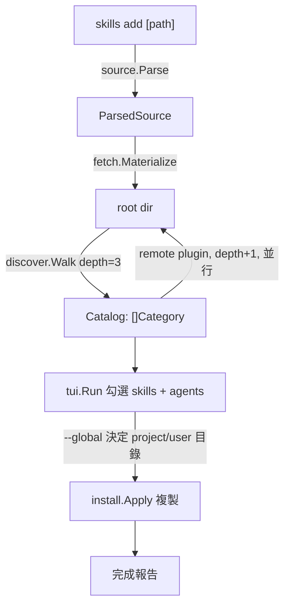

# `skills add` Go 版設計 (Design Spec)

日期：2026-07-04
分支：`golang`
Module：`github.com/bizshuk/skills`（repo 根目錄，取代 TS CLI）

## 目標 (Goal)

以 Go 重寫 `skills add [path]`，把每個 plugin 當「分類 (category)」、其下掛所有 skill，
機制可遞迴處理三種來源：相對路徑、GitHub repo (`<owner>/<repo>`)、以及一般 https 連結。
遇到外部連結／repo 會往下走訪，最大深度 3，並在主流程列出。
最終以互動 TUI 讓使用者勾選要安裝的 skills 與目標 agents，複製到對應安裝目錄。

`keep it simple`：優先正確、可測、單一職責分層；不做 lockfile、symlink、telemetry。

## 範圍 (Scope)

包含：來源解析、manifest 解析、遞迴並行走訪、互動 TUI、安裝（skills + subagents，project／user 兩層）。
不包含：lockfile、symlink、telemetry、`skills use`／`remove`／`update` 等其他子命令。

## 架構分層 (Architecture)

依 gosdk 框架層慣例：cobra 單一命令，slog 日誌，module 置於 repo 根目錄。

```tree
/ (module root, golang branch)
├── go.mod                      # module = github.com/bizshuk/skills
├── cmd/skills/main.go          # cobra root + add 指令接線
└── svc/
    ├── source/                 # 來源字串解析 (port source-parser.ts)
    ├── manifest/               # marketplace.json / plugin.json 解析與 source 解析
    ├── fetch/                  # Fetcher 介面：local / github tarball / git；並行、可重試
    ├── discover/               # 遞迴 BFS walker → Catalog
    ├── install/                # agent 安裝表 + 複製 skills/agents
    └── tui/                    # bubbletea：分類樹 + 目標勾選 + fetch 狀態
```

`svc/` 而非 `internal/`：保留日後把 `source`／`manifest` 抽到框架層被其他 repo 引用的彈性。

## 命令介面 (CLI)

```text
skills add [path]
  path            "<owner>/<repo>" | 相對／絕對路徑 | https 連結
  --global        寫入 user 層目錄（預設寫 project 層）
  --agent <name>  覆寫自動偵測，指定一或多個目標 agent（可重複）
  --depth <n>     遞迴最大深度（預設 3）
  --yes           跳過 TUI，安裝全部偵測到的 agents 與全部 skills
```

## 核心元件 (Components)

每個元件單一職責、以介面溝通、可獨立測試。

| 元件 | 職責 | 依賴 |
| --- | --- | --- |
| `source.Parse(s) (ParsedSource, error)` | 判別 local／`owner/repo`／github url／gitlab／git／well-known，抽出 ref、subpath、skillFilter | 無 |
| `manifest` | 解析 `marketplace.json`（多 plugin catalog，含 `metadata.pluginRoot`）與 `plugin.json`（單 plugin）；`ResolvePluginSource` 分 local／remote／fallback；`skills` 欄位為額外項，`skills/` 目錄一律掃 | source |
| `fetch.Fetcher` | 介面 `Materialize(ctx, src) (dir string, err error)`；local 直接回路徑，remote 抓 GitHub tarball 到 temp；`errgroup` 並行、transient 重試上限 5 | source |
| `discover.Walk(ctx, root, maxDepth) Catalog` | BFS 走訪：local plugin 掃成 `Category`；remote plugin depth+1 入列並行 fetch；`visited[ownerRepo]` 防環；`depth > maxDepth` 停 | manifest, fetch |
| `install.Apply(catalog, sel) error` | 對每個選定 agent 複製 `skills/*`→skillsDir、`agents/*.md`→agentsDir，依 `--global` 選 project／user 層 | agents 表 |
| `tui.Run(catalog) (Selection, error)` | 顯示 category→skill 樹、自動偵測並預勾 agents、失敗節點顯示 `unable to fetch`、回傳選取 | 上述型別 |

### 關鍵型別 (Key Types)

```go
type SourceType int // Local, GitHub, GitLab, Git, WellKnown

type ParsedSource struct {
    Type        SourceType
    URL         string // 正規化後的 URL 或本地絕對路徑
    Ref         string // 分支或 tag
    Subpath     string // repo 內子路徑
    SkillFilter string // owner/repo@skill 的 skill 名
    LocalPath   string // Type==Local 時的絕對路徑
}

type Skill struct {
    Name string // 目錄名
    Path string // SKILL.md 所在目錄的絕對路徑
}

type Category struct {
    PluginName string
    OwnerRepo  string // 來源，供防環與顯示
    Skills     []Skill
    FetchOK    bool
    FetchErr   string // 非空 → TUI 顯示 "unable to fetch"
}

type Catalog []Category

type Selection struct {
    SkillPaths []string   // 使用者勾選的 skill 目錄
    Agents     []AgentType
    Global     bool
}
```

## 資料流 (Data Flow)



## 遞迴語意 (Recursion Semantics)

- root = depth 0；每個 remote plugin hop +1；`depth > maxDepth`(預設 3) 停止走訪。
- 同一 `ownerRepo` 只走一次：`visited` set 防環與去重。
- 一層內多個 remote plugin 以 `errgroup` 並行 fetch。
- 網路失敗：該 `Category.FetchErr` 記錄錯誤、`FetchOK=false`，主流程繼續、不中斷；TUI 於該 plugin 名旁顯示 `unable to fetch`。

## Manifest 解析規則 (Manifest Rules)

移植自 TS `plugin-manifest.ts`：

- `marketplace.json`：`metadata.pluginRoot`（須以 `./` 開頭才有效）+ `plugins[]`。
  - plugin `source` 為 `undefined` → fallback 用父 repo 本身。
  - `source` 為 `"./path"` → local，於父 repo 內解析。
  - `source` 為物件（`{source:"github",repo}`／`{source:"url",url}`／`{source:"git-subdir",url,path}`）→ remote，交給 discover 遞迴。
  - path traversal 防護：解析出的目錄必須 contained 於 basePath；相對路徑須以 `./` 開頭。
- `plugin.json`：單 plugin at root，`skills` 欄位為額外項。
- 分組：plugin `name` 即 Category 名；`skills/` 下每個含 `SKILL.md` 的目錄為一個 Skill；`skills` 欄位明列者為額外 Skill（去重）。

## 安裝位置表 (Install Locations)

skills 目錄取自 main branch `agents.ts`；agents（subagent）目錄除 claude-code 外為推斷值，
已知需日後對 upstream 查證修正（本版先採推斷）。

| Agent | project skills | user skills | project agents | user agents |
| --- | --- | --- | --- | --- |
| claude-code | `.claude/skills` | `~/.claude/skills` | `.claude/agents` | `~/.claude/agents` |
| antigravity | `.agents/skills` | `~/.gemini/antigravity/skills` | `.agents/agents` | `~/.gemini/antigravity/agents` |
| antigravity-cli | `.agents/skills` | `~/.gemini/antigravity-cli/skills` | `.agents/agents` | `~/.gemini/antigravity-cli/agents` |
| codex | `.agents/skills` | `~/.codex/skills` | `.agents/agents` | `~/.codex/agents` |
| opencode | `.agents/skills` | `~/.config/opencode/skills` | `.agents/agents` | `~/.config/opencode/agents` |
| hermes-agent | `.hermes/skills` | `~/.hermes/skills` | `.hermes/agents` | `~/.hermes/agents` |

偵測安裝：以各 agent 的 home 目錄存在與否判定（如 `~/.codex`、`~/.gemini/antigravity`）。
`--global` 決定寫 user 層或 project 層；user 層目錄不存在時建立。

## 錯誤處理 (Error Handling)

- malformed manifest → 跳過該項，靜默（比照 TS）。
- transient network → 重試上限 5（依全域 CLAUDE.md），仍失敗才標 `unable to fetch`。
- path traversal → 拒絕該項並跳過。
- 無任何 skill 被發現 → 明確錯誤訊息退出。

## 測試策略 (Testing)

TDD 逐元件，table-driven 為主：

- `source`：移植 TS `source-parser.test.ts` 測資（shorthand、github tree url、gitlab subgroup、fragment ref、`@skill`、local）。
- `manifest`：fixture（marketplace.json / plugin.json）驗 category 分組、額外 skills 去重、traversal 防護。
- `fetch`：fake HTTP／local，驗並行與重試。
- `discover`：注入 fake `Fetcher` + 假 repo 樹，驗 depth 3 邊界、防環、`unable to fetch` 狀態傳遞。
- `install`：寫入 `t.TempDir()`，驗 project／user 兩層、skills 與 agents 複製。
- `tui`：bubbletea model 單元測（初始勾選、toggle、fetch 狀態渲染）。

## 非目標 (Non-Goals)

lockfile、symlink、telemetry、其他子命令、非上述六個 agent 的安裝目標。
